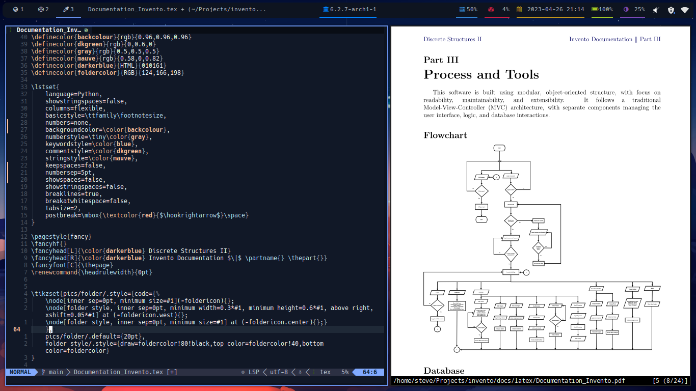

## :gear: Features

- [x] Compatible configuration for Termux (Android terminal emulator)
- [x] Edit LaTeX files with the help of `VimTex` and `Zathura` document viewer
- [x] Custom LaTeX snippets for quick math mode
- [x] Code completion on Python, C, C++, LaTeX, etc. using `nvim-cmp`
- [x] Language servers, Linters, Formatters, Debuggers, Build Tools
  - ls:`clangd` lint:`clang-tidy` format:`clang-format` debug:`gdb` build:`cmake` for C and C++
  - ls:`texlab` & `ltex-ls` format:`latexindent` for typesetting LaTeX
  - ls:`rust-analyzer` build:`cargo` for Rust
  - ls:`pyright` format:`black` for Python
  - ls:`jdtls` build:`gradle` for Java
  - ls:`zls` for Zig
  - Et al.
- [x] Web development setup



## :hammer_and_wrench: Setup

### Installation

To get started, install the following packages:

> Debian based distribution

```shell
sudo apt install git neovim ripgrep nodejs
```

> Arch based distribution

```shell
sudo pacman -S git neovim ripgrep nodejs
```

Clone the repository to `$HOME/.config/nvim`:

> create backup of your config before installing

```console
git clone https://github.com/steguiosaur/nvole.git ~/.config/nvim
```

Install plugins by running `nvim` in the terminal. It will automatically install
the package manager on initial startup. Type `Lazy install` in command mode to
install plugins. Restore repository default version of plugins with `Lazy restore`.

> Plugins listed at `~/.config/nvim/lua/nvole/plugins/` folder.

```shell
:Lazy restore
```

### Language Server Installation

This config uses [nvim-lspconfig](https://github.com/neovim/nvim-lspconfig) to manage
language server protocol. To install language servers, type `:Mason` in command
mode and look for the language server that suits your needs.

> There will be several language servers which automatically install.
> Go to `~/.config/nvim/lua/nvole/core/mason-init.lua` to view the listed servers.

Add new servers in `~/.config/nvim/lua/nvole/core/mason-init.lua`.

## :nut_and_bolt: Troubleshoot

### Mason ERROR Log: `Current platform is unsupported` in Termux

The config does not guarantee several Language Server or other tooling to work on
`ARM 64` architecture. Manual server installation is sometimes needed to make the LSP work.
We'll take `clangd` and `rust-analyzer` as an example:

- Install `clangd` using node package manager (requires `nodejs`): `npm i -g clangd`
- Install `rust-analyzer` using the built-in package manager: `sudo apt install rust-analyzer`

In some cases, the executable is not available on any package managers. The alternative
option for this is to clone the language server repository and compile the said
server before adding it to `$PATH`.

### `latexindent` formatter not working

Install `libxcrypt-compat` using the package manager. Termux compatibility not verified.
